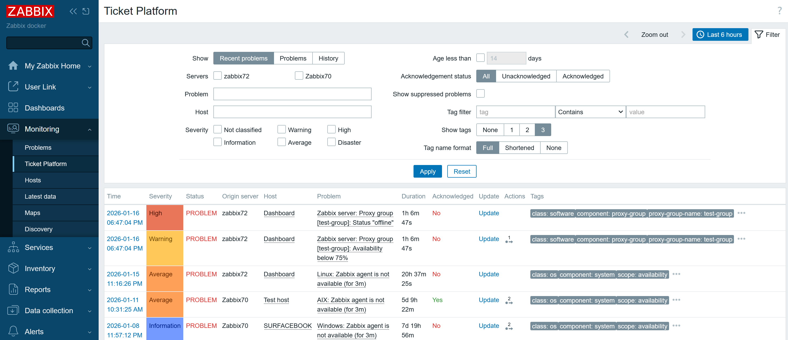
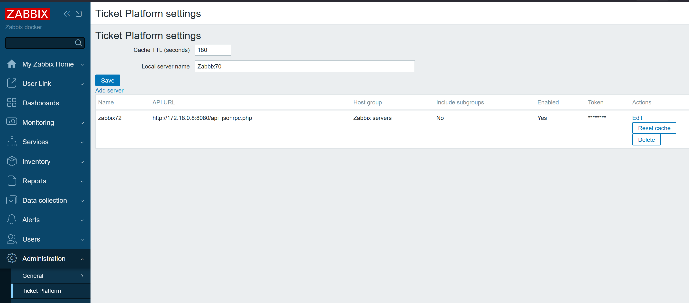

# Ticket Platform Zabbix Module

Ticket Platform is a custom Zabbix module that aggregates problems from multiple Zabbix servers into a single view.
It mirrors the built-in Problems page and adds origin tracking, remote updates, and per-server settings.

## Credits
Inspired by the Zabbix Summit 2025 talk on multi-instance operations:
https://www.zabbix.com/events/zabbix_summit_2025_agenda#day2_16:10

## Features
- Centralized "Ticket Platform" view based on the Problems module.
- Supports multiple remote Zabbix servers with API token auth.
- "Origin server" column shows where each problem came from.
- Local cache to reduce remote API load, with per-server cache reset.
- Problem updates (acknowledge, suppress, severity, close) routed to the originating server.
- Event details view rendered locally with data pulled from remote APIs.
- Host popup integration:
  - Local hosts use the standard Zabbix host menu.
  - Remote hosts provide a menu to filter by host and open a remote host editor popup.
  - Remote host editor supports editing fields available via API (hostgroups/templates are disabled).

## Configuration
Administration -> Ticket Platform:

Global settings:
- Cache TTL (seconds): how long problem data is cached per server.
- Local server name: label used for the local Zabbix instance in filters and the Origin column.

Per-server settings:
- Name: label shown in the Origin column and server filter.
- API URL: remote API endpoint, for example `http://host:8080/api_jsonrpc.php`.
- API Token: authentication token for the remote API.
- Hostgroup: optional filter; when set, only problems from this group (and optionally its subgroups) are included.
- Include subgroups: include subgroup problems when Hostgroup is set.
- Enabled: toggle to include/exclude the server.
- Reset cache: clears cached data for this server immediately (useful after updates).

## Usage
Monitoring -> Ticket Platform:
- Use filters like the Problems view (severity, tags, acknowledgement, host, time range).
- Use "Show suppressed problems" to include suppressed events.
- Use host/trigger menus for navigation and updates.

